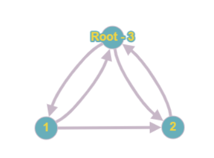
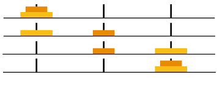
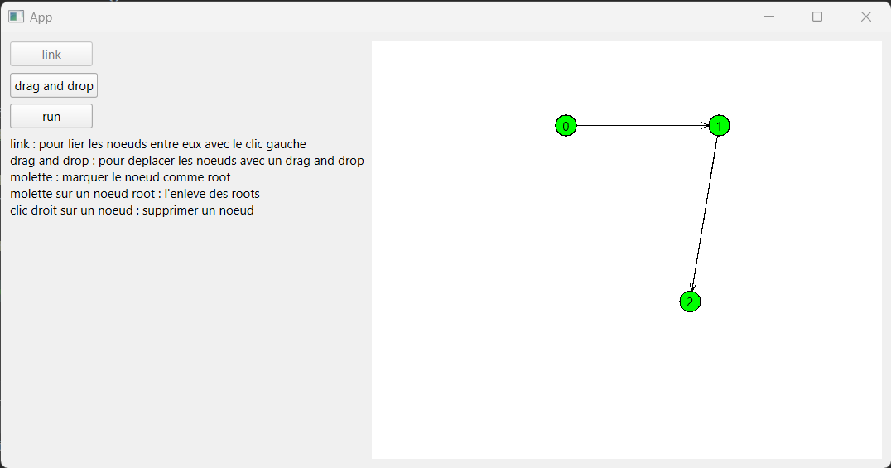

# Projet Validation - ENSTA Bretagne
*MOTET Alexi - HOARAU William - BERTELOOT Emile*

### Description
Notre projet de validation réalisé lors de notre 3ème année à l'ENSTA Bretagne 
dans la filière CSN a pour but de réaliser un simulateur de programmation par contrainte.

Pour réaliser celà nous avons travaillé par étape :

#### Model & Graph
Nous avons dans un premier temps chercher à modéliser un graph de POO. Pour celà, nous avons créé la classe *DictGraph* qui contient le nom du nœud racine *self.roots* et *self.d* représentant les transitions au sein du graph modélisé grace à un dictionnaire.

Par exemple ``DictGraph([3], {3: [1, 2], 1: [3, 1], 2: [3]})`` représente ici :

 

Nous avons ensuite chercher à parcourir notre graph dans ``TransitionRelation``, pour celà nous parcourons notre graphe en largeur dans ``bfs`` en marquant les nœuds les uns à la suite des autres lors de chaque visite.

#### Des exmples : nbits & hanoi

Dans ``nbits`` nous avons cherché à modéliser à partir d'un graphe tout les mots binaires de nbits et les transitions de celui-ci en ne changenat qu'un bit à la fois.

Dans ``hanoi`` nous avons cherché à résoudre le problème de la tour de hanoi en avec un nombre de disques variable et de tours variables.

 

Pour celà nous modélisons le tout par un graph en se fixant une condition sur la transition entre 2 configurations, un disque ne peut pas plus grand ne peut pas être au-dessus d'un disque plus petit.

#### Avoir une Trace

``trace_`` nous permet de visualiser les transitions d'une configuration (nœud) à une autre en ligne de commande.

#### Semantic  : Alice & Bob

Nous avons cherché à implémenter des transitions avec une garde modéliser par une lambada fonction renvoyer un booléen et une action modéliser par une lambada fonction modifiant les variables de la Configuration. Cette logique est implémenté dans ``semantic``.

Nous avons ensuite cherché à réaliser modéliser l'exemple d'Alice & Bob qui représente l'accès mutuel à une ressource critique dans ``AandB``.
Une deuxième version ``AandB_deadlock`` permet de résoudre le problème de *deadlock*, le moment où Alice et Bob demande à rentrer en section critique en même temps. Pour celà on rajoute une règle pour laquelle Bob à la droit de changer d'avis en revenant à son état initial.

#### Composition : Se déplacer dans 2 graphes avec les mêmes variables

``property``

#### BONUS - Interface Graphique & Test Unitaire

Nous avons créer une interface graphique permettant à l'utlisateur de créer son propre graph et de montrer son parcours par un parcours en largeur (*Breadth-First Search* - bfs).

Pour celà il faut :

* Clicker sur *Link*
* Puis n'importe où dans la fenêtre blanche pour y ajouter un nœud
* Clicker de nœud en nœud pour y ajouter des liens
* Réaliser un click molette sur un nœud afin qu'il soit le départ de notre parcours de graph

Nous pouvons enfin, clicker sur *run* pour pour voir le parcours du graph de manière graphique.

 

Des unitaires unitaires permettant une converture de 100% ont été réaliser.
Aucun animal n'a été maltraité lors de la réalistion de ce projet.

C'est nous qui avons prété notre chargeur USB-C quand vous étiez dans le besoin.