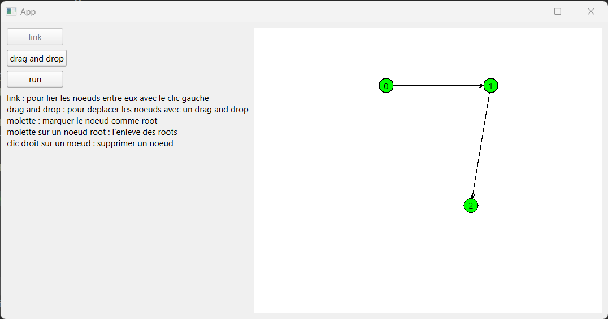

# Projet Validation - ENSTA Bretagne
*MOTET Alexis - HOARAU William - BERTELOOT Emile*

### Description
Ce travail porte sur le parcours de graphe et le modèle checking.

Il y a trois types de graphes différents qui peuvent être créés et parcourus (ils héritent de TransitionRelation) :
- DictGraph, graphe basé sur un ensemble clé-valeur avec pour clé un noeud "source" et pour valeur une liste de noeuds "destination"
- Hanoi, où chaque noeud du graphe correspond à un état du jeu
- NBits, où la racine du graphe est un nombre binaire sur n bits et où les enfants sont des répliques de leur parent avec un unique bit flippé (01 a pour enfants 11 et 00)

Pour le graphe basé sur un dictionnaire, nous avons implémenté une interface graphique avec PyQt6 ("app.py", "python app.py" pour l'exécuter). On utilise la souris pour placer des noeuds et les retirer, pour les mettre en racine ou non, et pour les relier entre eux. Lorsque le graphe est dessiné, on peut le parcourir en cliquant sur "run".

 

On peut chercher un noeud vérifiant un prédicat et afficher la trace menant au noeud désiré grâce à la classe ParentTraceProxy qui se comporte comme un wrapper du graphe à parcourir.

Nous avons aussi implémenté un type de graphe plus abstrait, où les noeuds sont des configurations, dépendant d'un langage qu'on décrit avec des règles qui nous indiquent quand est-ce qu'on peut passer d'une configuration à une autre (garde) et de quelle façon la configuration est modifiée (exécution). 

Nous avons testé notre langage sur le fameux problème d'Alice et Bob. Dans le cas le plus simple, la configuration est composée des états d'Alice et de Bob (état Jardin ou Maison), il existe quatre règles pouvant être exécutées : AliceToHome (à condition qu'elle soit dans le jardin), AliceToGarden (à condition qu'elle soit chez elle), et réciproquement pour Bob.

Enfin, on a testé un modèle checker sur un mini-programme de notre invention, qui peut ajouter ou soustraire 1 à une variable x. Le modèle checker regarde si la variable est bien égale à une variable n à un moment donné, puis vérifie qu'il y a bien un cycle à partir de l'état d'acceptation trouvé. Il y a au moins un cycle car si x + 1 mène vers un état d'acceptation avec x + 1 + 1 - 1 mène vers x + 1 sans passer par x. A méditer.

Pour voir une démo du travail réalisé, il faut utiliser le framework de tests "unittest" qui est inclus avec Python.

Pour voir toutes les démos :

"python -m unittest demo"

Pour voir une démo particulière :

"python -m unittest demo.DemoComposition.test_composition"

Nous tenions à rappeler au lecteur de façon toute amicale que nous lui avions cordialement prêté et avec plaisir un chargeur USB-C lors de la dernière séance, séance durant laquelle nous avions amené quelques gourmandises dont nous croyons qu'elles n'ont point déplues au lecteur qui reste le maître de la notation de ce projet.

Nous voulions aussi vous préciser que nous avions malheureusement été gênés dans notre travail par un groupe d'énergumènes perturbateurs qui s'est amusé à imiter le singe et le cochon alors que nous cherchions silence et sérénité afin de parcourir nos graphes en paix. Voulant toutefois préserver une certaine cohésion et unité de classe, nous tairons leurs noms mais nous tenions à vous préciser leurs initiales et leur nationalités : S. N. (Français), Y. K. (Marocain), S. N. (Marocaine). Au lecteur de juger quelles sanctions seront appropriées à ces bachibouzouks, mais nous jugeons qu'un retrait d'un nombre entier de points supérieur à deux serait de bonne augure pour l'équilibre général des notes de notre filière.
